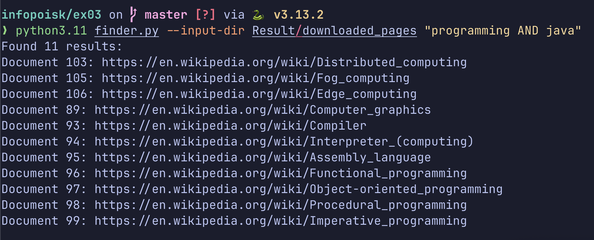
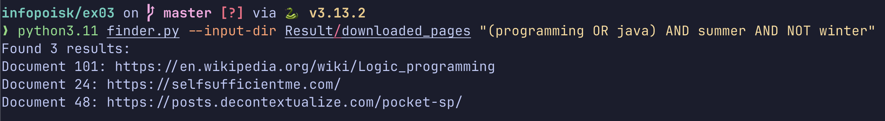

CLI finder that uses Result from previous exercise to automatically process the query and output the results without prompting for further input.

## Usage

```bash
python finder.py --input-dir ./input_dir "(programming OR java) AND summer AND NOT winter"
```

## Output examples 

Simple query example




Complex query



## Result

Result archive stored in https://drive.google.com/file/d/1PuIXHbE8_IF1Pq2oxh2a7AwrGvKm1ma4/view?usp=drive_link
